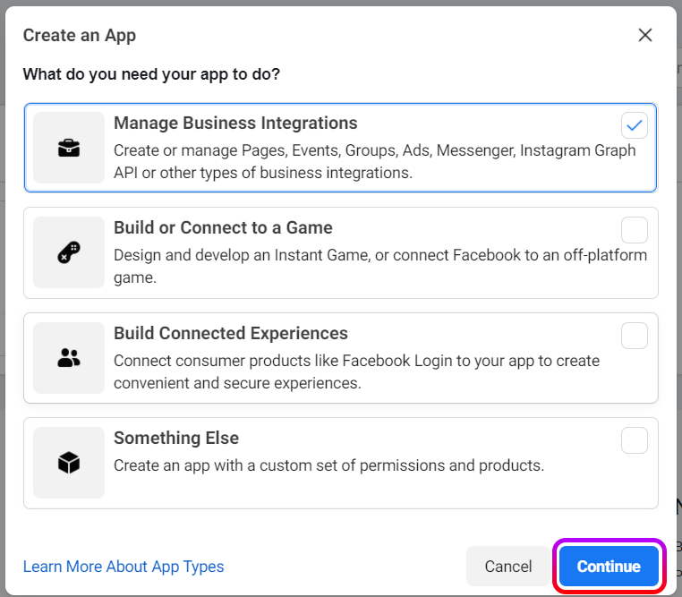
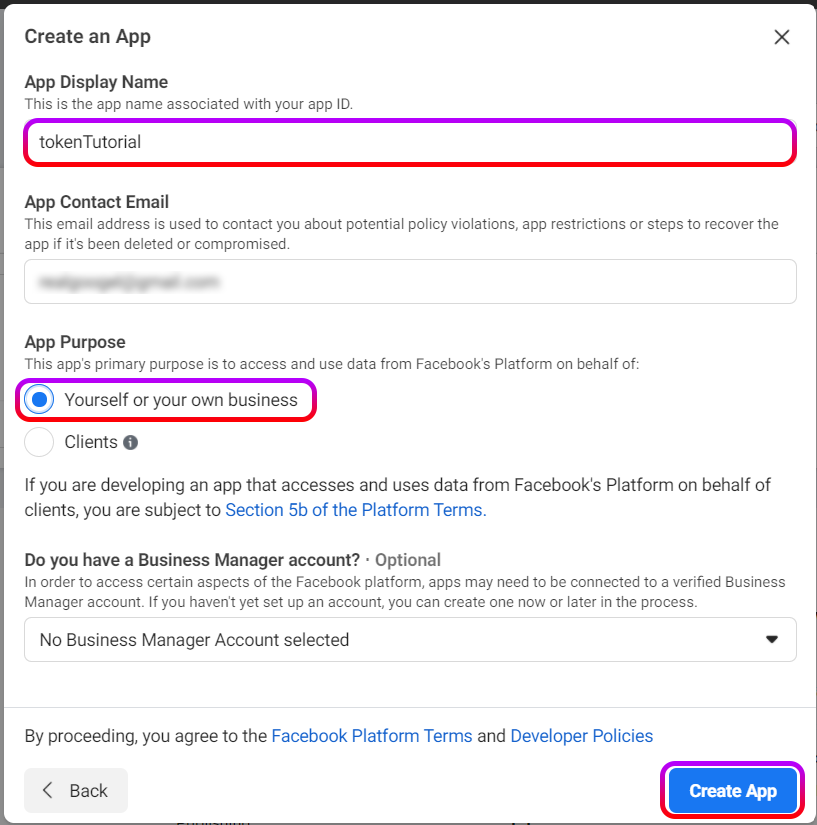
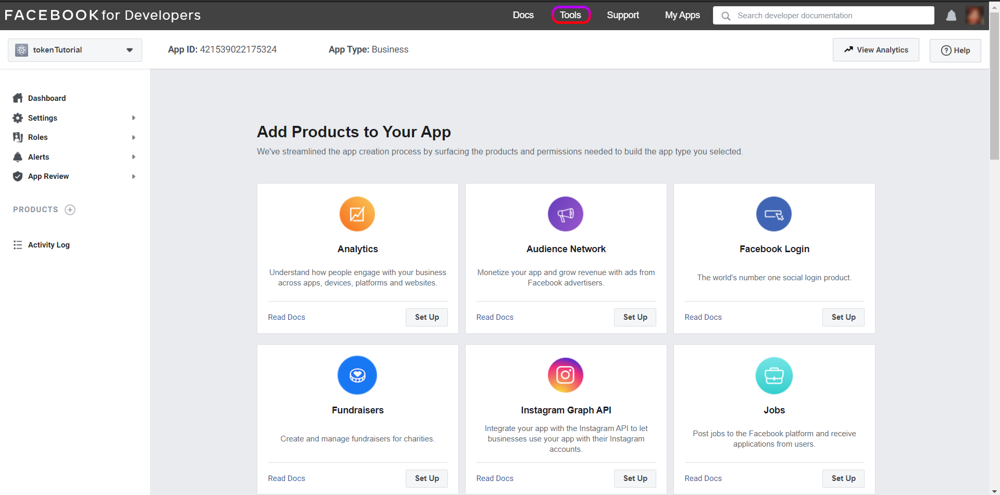
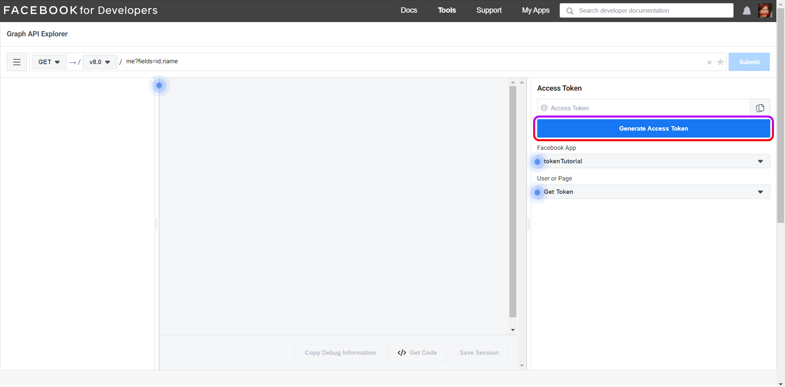
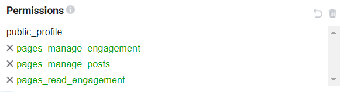
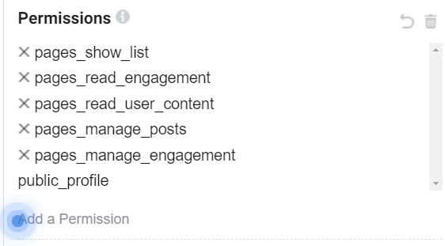
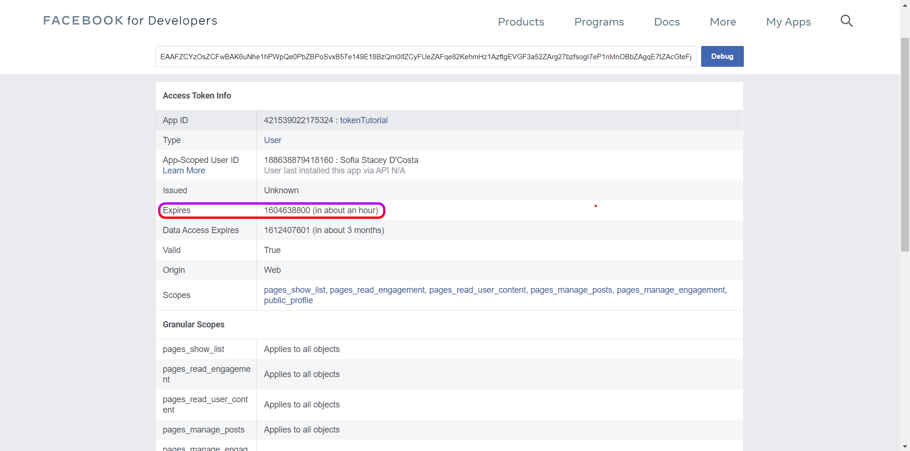
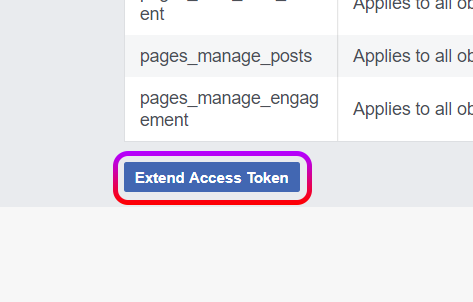
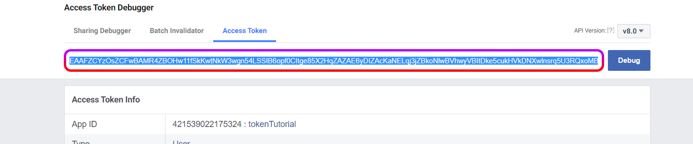
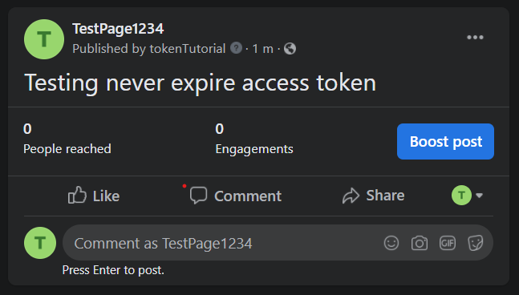

# Generate a never expire access token for your Facebook page by [boidushya](https://github.com/Boidushya)

## Check out the video tutorial: https://youtu.be/RMLcmDdOSxw

### Head over to [this page](https://developers.facebook.com/apps/) and click **Select App**

### Select *Manage Business Integrations* and click **continue**

### Change *App Display Name* and select *Yourself and your business* under App purpose and click **Create App**

### Head over to *Tools*

### And click on *Graph API Explorer*. This is where we will carry out most of the upcoming steps...

### Click **Generate Access Token** and complete the process by accepting and/or clicking Next.

### Click on *Add Permissions*

### Add *page_manage_engagements*, *page_manage_posts*, *page_read_engagement* and click on **Generate Access Token** again. If it gives you a prompt to select pages, click on  *Select All*
(**EDIT**: Althought the image below shows the perms in **green**, its supposed to turn **gray** after clicking on **Generate Access Token** again.If you try to do the later steps with the perms greened out, you will get an **error** saying you dont have the required permissions.

Make sure it goes from something like this:

to this:

### Copy the token generated and go to [this page](https://developers.facebook.com/tools/debug/accesstoken/).
Do not close your Graph API Explorer just yet! Open this page in a new tab... \
Paste your token and click on **Debug**

### Scroll down to the very bottom and click on **Extend Access Token**

### You should see something like this. Click on **Debug**.

### This should take you to a new page where you can copy your *extended access token*

### Head back to *Graph API Explorer* and paste the *extended access token* in Access Token box.
Change the text which currently says `me?fields=id,name` to `me/accounts`\
Click on submit and scroll down till you see your page name for which you want to generate access token.\
Your access token for the page should be the one *before* your page name.\
Copy the token and go back the [Access Token Debugger](https://developers.facebook.com/tools/debug/accesstoken/)

### Paste the token and click on debug.
If the *Expires* field says *never*, Congrats! You just created a *never expire access token* for your page!

### To test if the token works or not, go back to *Graph API Explorer* and change the `GET` to `POST`.
This should give you an option to *add parameters*. Add a field with `message` as key and *whatever text you want* as value\
Change the location field to `me/feed` and click on **Submit**

### Head back to your page.
If you did everything correctly, you should see your post on your page feed.

##### Viola! You did it! Now keep this token safely and use it to automate your [Frame Bot](https://github.com/Boidushya/FrameBot)!
