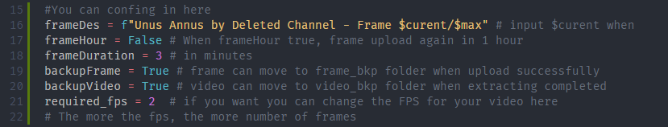

# Configuration main.py (by [yansaan](https://github.com/yansaan))

### frameDes
`frameDes` is caption default when image uploaded. This input have 2 value:
* `$curent` is curent number frame when uploaded. When this input not in use, program is not run.
* `$max` is total frame in video. This input **_optional_**

### frameHour
`frameHour` is boolean variable to enabled delay in 1 hour. when using minutes, changed to `False`

### frameDuration
`frameHour` is input for minutes duration, this input will be useless if `frameHour` set to `True`

### backupFrame and backupVideo
`backupFrame` is toggle make a frame move to flames_old when frame uploaded, and `backupVideo` is toggle make a video move to video_old when extract completed. When set to `False`, frame and video deleted automatically

### required_fps
`required_fps` is input when how many frames are extracted per second, The more the fps, the more number of frames